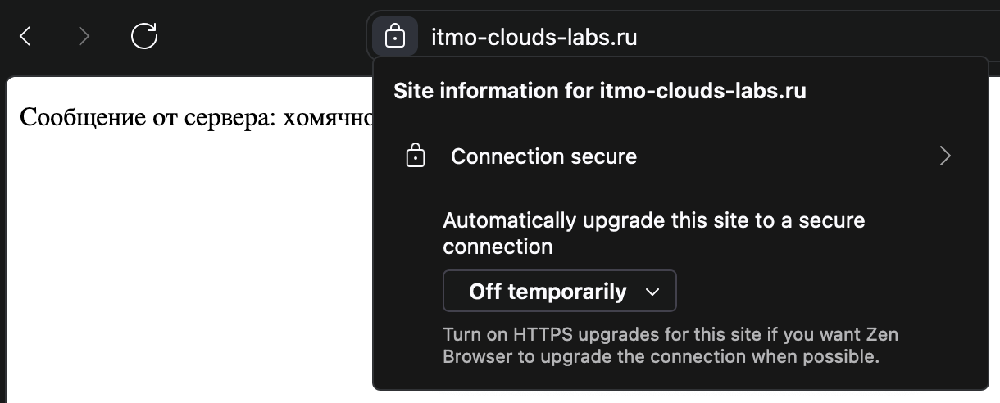
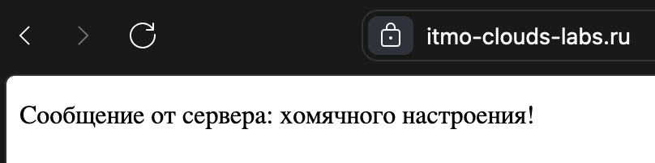
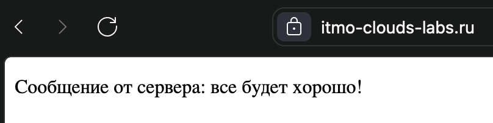

# Лабораторная работа №1

## Обязательное задание

### Введение

В данной лабораторной работе в качестве двух пет-проектов используются два скрипта на Python. Первый представляет из себя сервер, реализующий фронтенд, второй — реализующий бэкенд. Фронтенд возвращает HTML страницу, в которую встроен JS-скрипт. Этот скрипт запрашивает данные от бэкенда и выводит их на экран. Исходный код фронтенда и бэкенда находятся [здесь](frontend/server.py) и [здесь](backend/server.py) соответственно.

Для развертывания был арендован VDS-сервер, а также доменное имя `itmo-clouds-labs.ru`. Далее сервер и домен будут использоваться при настройке и развертывании Nginx.

Для доставки конфигурационных файлов до сервера использовался Git. С помощью утилиты командной строки данный репозиторий был склонирован на сервер. Все дальнейшие операции с файлами используют копию репозитория на сервере.

### Получение сертификатов

Лабораторная работа предполагает использование HTTPS-протокола для взаимодействия с сервером. Для использования HTTPS необходимо получить сертификаты.

Для получения сертификатов использовался certbot — утилита для получения сертификатов от Let's Encrypt. Let's Encrypt — это центр сертификации от некоммерческой организации ISRG, существующий при поддержке EFF и многих компаний, взявшей на себя миссию дать людям бесплатные SSL/TLS сертификаты для сайтов и серверов.

certbot был установлен следующим образом:

1. Установлены необходимые зависимости:

   ```bash
   sudo apt install python3 python3-venv libaugeas0 python3-certbot-nginx
   ```

2. Создано виртуальное окружение:

   ```bash
   sudo python3 -m venv /opt/certbot/
   sudo /opt/certbot/bin/pip install --upgrade pip
   ```

3. Установлен certbox:

   ```bash
   sudo /opt/certbot/bin/pip install certbot
   ```

4. Создан алиас для утилиты:

   ```bash
   ln -s /opt/certbot/bin/certbot /usr/bin/certbot
   ```

После установки certbot, были выписаны сертификаты с помощью следующей команды:

```bash
sudo certbot certonly --nginx
```

После выполнения команды и ввода необходимых данных, утилита вывела пути к созданным сертификатам:

```
Successfully received certificate.
Certificate is saved at: /etc/letsencrypt/live/itmo-clouds-labs.ru/fullchain.pem
Key is saved at:         /etc/letsencrypt/live/itmo-clouds-labs.ru/privkey.pem
```

Далее они будут использоваться при настройке Nginx.

### Настройка Nginx

Для настройки Nginx использовался конфиг, исходных код которого находится [здесь](nginx/nginx.conf). В нем можно выделить две части: конфигурация для фронтенда и для бэкенда. Рассмотрим каждую из них.

Конфигурация для фронтенда выглядит следующим образом:

```nginx
# frontend
server {
    server_name itmo-clouds-labs.ru;

    listen 443 ssl;
    ssl_certificate /etc/letsencrypt/live/itmo-clouds-labs.ru/fullchain.pem;
    ssl_certificate_key /etc/letsencrypt/live/itmo-clouds-labs.ru/privkey.pem;
    include /etc/letsencrypt/options-ssl-nginx.conf;
    ssl_dhparam /etc/letsencrypt/ssl-dhparams.pem;

    location / {
        proxy_pass http://localhost:3000;
    }
}

# https redirect
server {
    listen 80;
    server_name itmo-clouds-labs.ru;
    return 301 https://itmo-clouds-labs.ru$request_uri;
}
```

В данном конфиге представлены две конфигурации `server`. Первая отвечает за HTTPS запросы и перенаправление их фронтенд серверу. Вторая отвечает за перенаправление HTTP запросов на HTTPS (т. е. к первой конфигурации).

Далее перечислены директивы и их назначения:

- `server_name` — указывается, на запросы с каким заголовком `Host` действуют далее описанные правила;
- `listen` — указывается, для какого порта действуют далее описанные правила;
- `ssl_certificate`, `ssl_certificate_key` и `ssl_dhparam` — настройка сертификатов;
- `location` — указывается, для каких HTTP-запросов действуют далее описанные правила (в данном случае для всех);
- `proxy_pass` — проксирование запроса (в данном случае фронтенд серверу).

Конфигурация для бэкенда выглядит похожим образом:

```nginx
# backend
server {
    server_name api.itmo-clouds-labs.ru;

    listen 443 ssl;
    ssl_certificate /etc/letsencrypt/live/itmo-clouds-labs.ru/fullchain.pem;
    ssl_certificate_key /etc/letsencrypt/live/itmo-clouds-labs.ru/privkey.pem;
    include /etc/letsencrypt/options-ssl-nginx.conf;
    ssl_dhparam /etc/letsencrypt/ssl-dhparams.pem;

    location / {
        proxy_pass http://localhost:8000;

        # CORS
        add_header 'Access-Control-Allow-Origin' '*';
        add_header 'Access-Control-Allow-Methods' 'GET, POST, HEAD, OPTIONS';
    }
}

# https redirect
server {
    listen 80;
    server_name api.itmo-clouds-labs.ru;
    return 301 https://api.itmo-clouds-labs.ru$request_uri;
}
```

Единственное отличие, за исключением измененного хоста (вместо `itmo-clouds-labs.ru` теперь `api.itmo-clouds-labs.ru`), — это наличие директив `add_header`, которые разрешают кросс-доменные запросы (чтобы фронтенд мог ходить в бэкенд).

После того, как конфиг был дописан, его было необходимо переместить в папку конфигураций Nginx. Это было сделано следующими командами:

1. Удалены предыдущие файлы конфигураций:

   ```bash
   sudo rm /etc/nginx/sites-{available,enabled}/default
   ```

2. Созданы символические ссылки на ранее представленную конфигурацию:

   ```bash
   sudo ln -s ~/itmo-clouds-labs/labs/lab-1/nginx/nginx.conf /etc/nginx/sites-available/default
   sudo ln -s ~/itmo-clouds-labs/labs/lab-1/nginx/nginx.conf /etc/nginx/sites-enabled/default
   ```

После этого Nginx был перезагружен с помощью следующей команды:

```bash
sudo systemctl restart nginx
```

### Тестирование

При переходе по ссылке <https://itmo-clouds-labs.ru> открывается сайт с действительным сертификатом:



При обновлении страницы фраза, выводимая на экран, меняется:





Это свидетельствует о том, что фронтенд и бэкенд работают, при этом у фронтенда получается доставить свой запрос до бэкенда.

### Заключение

В данной лабораторной работе был настроен Nginx для обслуживания фронтенда и бэкенда по протоколу HTTPS. Для реализации фронтенда и бэкенда использовались скрипты на Python, а для получения сертификатов использовался certbot.

## Задание со звёздочкой

### Введение

В данной лабораторной работе nginx команды №3 был проверен на некоторые уязвимости.

### Ход работы

### Запуск чужого nginx

Для тестирования nginx с конфигами команды №3 был запущен на ПК. Для этого была создана директория test и в ней тестовый файл конфигурации. Источник: https://github.com/maksimfisenko/itmo-cloud-systems-and-services/blob/main/labs/lab-1/lab-1.md.


На рисунке ниже видно, что результат команды "sudo nginx -t" был успешен, однако при перезапуске nginx вылезли ошибки, так как используемые порты были использованы под лабораторную работу по информационной безопасности.


Так как лаба по инфобезу уже была сделана, все службы можно было отключить, а порты освободить. После чего nginx успешно перезапустился и в браузере открылась html-страничка.


Теперь можно приступать к проверке уязвимостей.

### Проверка заголовков HTTP

Некоторые уязвимости могут быть связаны с недостаточной защитой заголовков HTTP. Самые важные заголовки, которые стоит проверить в первую очередь: 
X-Content-Type-Options: должен быть установлен в nosniff.
X-Frame-Options: предотвращает атаки типа "clickjacking".
Content-Security-Policy: помогает защититься от XSS-атак.
Для проверки заголовков использовалась утилита curl - она позволяет выполнять HTTP-запросы с различными параметрами и методами.


Что можно вынести из скрина: 
1. Переадресация с HTTP на HTTPS.
Статус ответа 301 (Moved Permanently): Это означает, что запрос к серверу по протоколу HTTP был успешно перенаправлен на HTTPS (как и было сказано в описании лабы 1). Это хорошая практика безопасности, так как она принуждает пользователей использовать защищенное соединение.
Заголовок Location: Указывает на новый адрес, на который был перенаправлен запрос: https://red.samsemrod.ru:8443/. Вообще порт 8443 нестандартный, обычно используется порт 443, но здесь это скорее всего локальное решение создателей (возможно у них порт 443 занят чем-то важнее, чем у меня, тем, что лучше не останавливать и не перенаправлять на другой порт). Или может это намеренное крутое решение, потому что злоумышленники скорее всего будут пытаться использовать дефолтный порт для протокола HTTPS, а если не знать, что нужен порт 8443, то можно долго заниматься перебором и в конце концов сдаться.
2. Информация и сервере.
Тут всё предельно просто: используемый сервер - Nginx версии 1.18.0 на Ubuntu (хорошо, что Debian и Ubuntu - 2 сапога пара и не конфликтуют). Замечу, что версия Nginx довольно устаревшая и было бы здорово обновить Nginx до последней стабильной версии, чтобы иметь доступ к новым функциям и исправлениям безопасности.
3. Заголовки.
Ожидаемо, заголовки, упомянутые в начале, отсутствуют, возможно потому что в описании к лабе 1 просили не углубляться в безопасность Nginx.
Рекомендации по улучшайзингу: заменить порт 8443 на 443 (опционально, если это неосознанный выбор, так как может не все пользователи будут знать, что надо указать порт 8443), обновить версию Nginx, настроить заголовки безопасности. Пример:
```nginx
   # Настройка портов и сертификата безопасности
   add_header X-Content-Type-Options nosniff;
   add_header X-Frame-Options DENY;
   add_header Content-Security-Policy "default-src 'self'";
   # Остальная конфигурация
```
### Проверка уязвимости SSL/TLS протоколов

Для проверки этой уязвимости было использовано nmap-сканирование.


Выводы из результата сканирования: 
1. Версии протоколов.
Сканируемый сервер использует 4 версии протокола TLS: 1.0, 1.1, 1.2 и 1.3. В целом это хорошо, потому что поддержка последних версий 1.2 и 1.3 - важный аспект безопасности веб-сервера. Однако версии 1.0 и 1.1 уже нежелательны, так как они уже устарели и являются менее безопасными.
2. Использование шифров для протокола.
Сервер использует следующие шифры: ECDHE с AES и CHACHA20, ECDHE с GCM и CHACHA20, RSA с CBC и GCM. Чтобы понять, насколько всё круто, надо посмотреть на оценку используемых шифров - у всех она А, то есть защита оценена на отлично. Также стоит отметить, что для сервера приоритетнее его собственный выбор шифров, а не выбор пользователя. Это тоже относится хорошей практике безопасности.
3. Отсутствие компрессии.
Флаг алгоритмов компрессии равен NULL, это тоже хорошая практика, потому что компрессия приводит к уязвимостям, например, к CRIME-атакам.
Рекомендации по улучшайзингу: отключить устаревшие притоколы TLSv1.0 и TLSv1.1 и регулярно обновлять компоненты, чтобы поддерживать защиту от существующих уязвимостей.

### Проверка прав доступа к директориям и файлам

Для проверки была использована утилита ls.


Выводы из результата:
1. Права доступа.
Флаг "rw-" указывает на то, что только владелец файла (lisa) может и читать и изменять файл. Флаг "r--" указывает на то, что все пользователи группы users могут только читать файл. И повторный флаг "r--" указывает, что все остальные пользователи также имеют доступ только в режиме чтения.
2. Ссылки на файлы.
Для каждого файла есть 1 жёсткая ссылка.
Также указаны владелец файла, группа пользователей, к которым файл принадлежит и размеры файлов.
Рекомендации по улучшайзингу: почти нет, настройки доступа конкретно этого сервера относятся к хорошей практике безопасности, так как только владелец файла может его менять, что защищает файл от возможных изменений другими пользователями. На случай масштабирования: если увеличится трафик, можно воспользоваться оптимизацией изображений, например сжатия redlenin.jpg и ввести в привычку делать резервное копирование файлов и конфигов сервера на случай утечки и/или потери данных.

### Проверка уязвимостей XSS

XSS это Cross-Site Scripting (межсайтовый скриптинг). Суть атаки заключается во внедрении вредоносного кода в страницу. Атака не затрагивает серверную часть, но напрямую влияет на клиентскую — на пользователей уязвимого сервиса. Для проверки была использована nmap. 


Видно, что уязвимостей не обнаружено (даже несмотря на то, что отсутствует заголовок HTTP, призванный защищать от подоюных атак), не удивительно, ведь нет полей для ввода и сам вредоносный код собственно и некуда загружать. Рекомендаций по улучшайзингу нет.

### Проверка прочих уязвимостей

Была использована утилита nmap с флагом -sV (сканирование версий служб).


Выводы по результатам сканирования (помимо уже известных данных, например, версий Nginx, ОС и т.д.):
1. Обнаружена уязвимость на порту 8443.
CVE-2011-3192 (Apache byterange filter DoS): Nmap указал, что сервер уязвим к атаке отказа в обслуживании (DoS), связанной с некорректной обработкой диапазонов байтов (byterange). Вообще эта уязвимость касается веб-серверов Apache, но в данном случае Nmap может ошибочно указать её из-за использования похожих конфигураций и устаревшей версии Nginx. В данном случае рекомендуется проверить, используется ли на сервере компонент Apache или элементы его конфигурации.
Рекомендации: обновить сервер и добавить настройки для защиты от атак типа byte range DoS. На данный момент если устроить DDoS-атаку сервер скорее всего упадёт.

### Заключение

В ходе выполнения данной лабораторной работы был исследован веб-сервер команды №3 на предмет уязвимостей. Выводы: отсутствие заголовков делает сервер уязвимым к MIME-атакам и атакам типа "clickjacking". Использование устаревших версий протокола TLS не защитит сервер от POODLE атак (Padding Oracle On Downgraded Legacy Encryption), BEAST атак (Browser Exploit Against SSL/TLS) и прочих. В сервере отлично настроены уровни безопасности для пользователей и использован нестандартный порт для HTTPS запросов, что делает его более защищённым, однако при большой нагрузке сервер может не справиться с количеством запросов.
