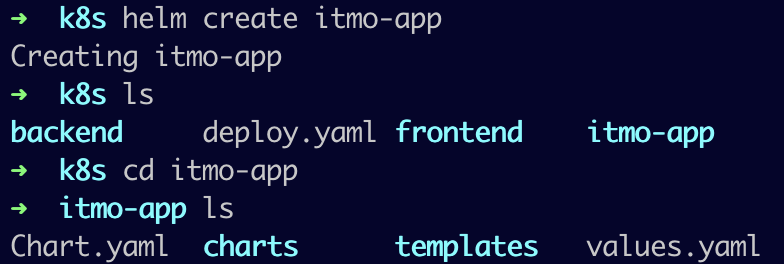
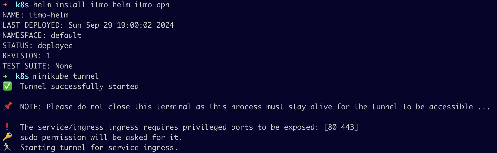
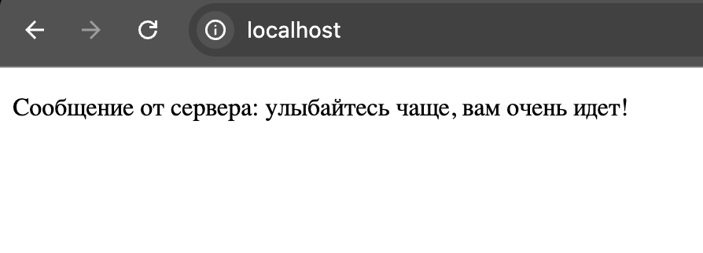
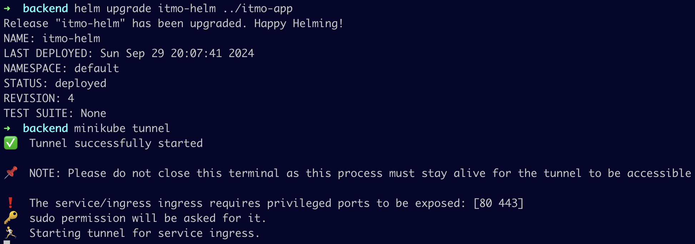

# Лабораторная работа №3

## Обязательное задание

### Введение

В данной лабораторной работе необходимо было локально поднять kubernetes кластер с помощью minikube. При этом в кластере должен быть развернут сервис, используя 2-3 ресурса kubernetes. Использование YAML-файлов, запускаемых одной командой, рекомендуется.

### Скачивание minikube и поднятие кластера

Сначала были скачаны и установлены утилиты minikube и kubectl, необходимые для развертывания приложений, проверки и управления ресурсами кластера.

Далее был запущен minikube с помощью команды `minikube start`, что видно на рисунке:


Затем для проверки работы кластера, а конкретно работы кластера на конкретной ноде была использована команда `kubectl get nodes`. Результат выполнени видно на рисунке ниже.


### Создание контейнеров и написание YAML-конфигов

В качестве системы контейнеризации используется Docker. С его помощью были собраны образы backend и frontend из предыдущей лабораторной работы, они представлены на рисунке ниже.


Для начала был создан namespace в YAML-файле для удобства управления будущими подами. Его конфиг представлен ниже.

```yaml
apiVersion: v1
kind: Namespace
metadata:
  name: itmo
```
Далее был описан под с контроллером Deployment для образа backend. В нем мы прописываем, название, принадлежность к пространству имен, количество реплик, Docker-образ, политику получения Docker-образов, прослушиваемый порт в контенере.

```yaml
apiVersion: apps/v1
kind: Deployment
metadata:
  name: backend
  namespace: itmo
  labels: 
    app: backend
spec:
  replicas: 1
  selector:
    matchLabels:
      app: backend
  template:
    metadata:
      labels:
        app: backend
    spec:
      containers:
        - name: backend
          image: "backend:1.0"
          imagePullPolicy: Never
          ports:
            - containerPort: 8000
```

Затем описываем Service для пода backend для дальнейшей настройки доступа к подам. В YAML-файле для работы сервиса определено имя, пространство имен, порт самого сервиса и порт контейнера, на который будет транслирован трафик.

```yaml
apiVersion: v1
kind: Service
metadata:
  name: backend-service
  namespace: itmo
spec:
  selector:
    app: backend
  ports:
      - port: 8000
        targetPort: 8000
```

Далее был описан Deployment для образа frontend. В его YAML-файле описаны имя пода, пространство имен, количество реплик, Docker-образ, политика получения Docker-образов и номер порта контейнера:

```yaml
apiVersion: apps/v1
kind: Deployment
metadata:
  name: frontend
  namespace: itmo
  labels:
    app: frontend
spec:
  replicas: 1
  selector:
    matchLabels:
      app: frontend
  template:
    metadata:
      labels:
        app: frontend
    spec:
      containers:
        - name: frontend
          image: "frontend:1.0"
          imagePullPolicy: Never
          ports:
            - containerPort: 3000
```

Так же, как и для backend, для frontend был написан Service. В нем так же прописано название, пространство имен, порт сервиса и порт контейнера.

```yaml
apiVersion: v1
kind: Service
metadata:
  name: frontend-service
  namespace: itmo
  labels:
    app: frontend
spec:
  ports:
      - port: 3000
        targetPort: 3000
  selector:
    app: frontend
```

Было принято решение использовать объект Ingress для проксирования трафика от внешнего источника до сервисов внутри кластера, так как нам необходимо делать запросы из браузера в backend. YAML-файл Ingress описывает имя, пространство имен, в котором будет работать объект, адрес и пути, в соответствии с которыми трафик будет направляться на порт 3000 для frontend, и на порт 8000 при обращении к backend. Для корректной работы Ingress была заранее использована команда `minikube addons enable ingress`.

```yaml
apiVersion: networking.k8s.io/v1
kind: Ingress
metadata:
  name: ingress
  namespace: itmo
spec:
  ingressClassName: nginx
  rules:
  - host: localhost
    http:
      paths:
      - path: /
        pathType: Prefix
        backend:
          service: 
            name: frontend-service
            port: 
              number: 3000
      - path: /api
        pathType: Prefix
        backend:
          service: 
            name: backend-service
            port: 
              number: 8000
```

### Применение конфигов

Для удобства применения данного конфига и в соответствии с заданием все YAML-файлы были слиты в один конфиг `deploy.yaml`. Для его применения была использована команда `kubectl apply -f deploy.yaml`. Таким образом, на картинке ниже можно увидеть все созданные объекты kubernetes.


### Создание тоннеля и проверка корректной работы кластера

Далее для проверки работы нашего кластера была использована команда `minikube tunnel`, которая создает свой сетевой маршрут на хосте. В нашем случае Ingress-контроллер будет направлять трафик, приходящий на кластер, в поды.


В браузере для проверки работы кластера и его взаимодействия заходим на localhost и наблюдаем успешную работу кластера с откликом от backend.


## Задание под звездочкой

### Введение

В данной части лабораторной работы необходимо было создать helm-chart на основе 3 обычной лабораторной работы и задеплоить все в кластер. Далее согласно заданию нужно изменить что-то в сервисе и применить эти изменения с помощью `helm upgrade`. Также расписать 3 преимущества использования helm перед классическим деплоем с помощью манифестов k8s.

### Установка и запуск helm

Сначала необходимо было установить и запустить helm. Был создан базовый chart с помощью команды `helm create <chart-name>`, в нашем случае названием chart послужит itmo-app.



В файле Chart.yaml были удалены комментарии, теперь он выглядит таким образом:

```yaml
apiVersion: v2
name: itmo-app
description: A Helm chart for itmo-app
type: application
version: 0.1.0
appVersion: "1.16.0"
```

### Файл свойств values.yaml

Сначала был описан файл свойств values.yaml, в котором определены будут основные настройки, которые пользователь может при желании переопределить. К таким настройкам будут относиться название Deployment и Service и у backend и у frontend, количество реплик подов, порт сервиса для подключения  подам, образ с версией, политика получения Docker-образов. Для Ingress можно название, calssName и хост.

```yaml
backend:
  deployment:
    name: backend
    replicas: 1
  service:
    name: backend-service
    port: 8000
  image:
    name: backend
    tag: "1.0"
    pullPolicy: Never

frontend:
  deployment:
    name: frontend
    replicas: 1
  service:
    name: frontend-service
    port: 3000
  image:
    name: frontend
    tag: "1.0"
    pullPolicy: Never

ingress:
  name: ingress
  className: nginx
  host: localhost
```

### Использование шаблонов, \_helpers.tpl

Файл \_helpers.tpl содержит вспомогательные функции и метки, которые используются в шаблонах. В нашем случае данный файл будет выглядеть вот так:

```yaml
{{- define "itmo-app.selectorLabels" -}}
app.kubernetes.io/name: {{ .Chart.Name }}
app.kubernetes.io/instance: {{ .Release.Name }}
{{- end -}}

{{- define "itmo-app.chart" -}}
{{- printf "%s-%s" .Chart.Name .Chart.Version | replace "+" "_" | trunc 63 | trimSuffix "-" -}}
{{- end -}}

{{- define "itmo-app.labels" -}}
helm.sh/chart: {{ include "itmo-app.chart" . }}
{{ include "itmo-app.selectorLabels" . }}
app.kubernetes.io/version: {{ .Chart.AppVersion | quote }}
app.kubernetes.io/managed-by: {{ .Release.Service }}
{{- end -}}
```

Далее для удобства создания chart'а был переработан общий YAML-файл и разделен на frontend.yaml и backend.yaml, в которых содержатся Deployment и Service, и ingress.yaml. Ниже представлен frontend.yaml, однако, как можно заметить, в нем вместо некоторых значений указаны шаблоны, в которые будут подставлены данные из файла values.yaml и шаблоны из \_helpers.tpl.

```yaml
apiVersion: apps/v1
kind: Deployment
metadata:
  name: {{ .Values.backend.deployment.name }}
  labels:
    app: backend
    {{- include "itmo-app.labels" . | nindent 4 }}
spec:
  replicas: {{ .Values.backend.deployment.replicas }}
  selector:
    matchLabels:
      app: backend
      {{- include "itmo-app.selectorLabels" . | nindent 6 }}
  template:
    metadata:
      labels:
        app: backend
        {{- include "itmo-app.selectorLabels" . | nindent 8 }}
    spec:
      containers:
      - name: backend
        image: "{{ .Values.backend.image.name }}:{{ .Values.backend.image.tag }}"
        imagePullPolicy: {{ .Values.backend.image.pullPolicy }}
        ports:
        - containerPort: 8000
---
apiVersion: v1
kind: Service
metadata:
  name: {{ .Values.backend.service.name }}
spec:
  selector:
    app: backend
    {{- include "itmo-app.selectorLabels" . | nindent 4 }}
  ports:
  - port: {{ .Values.backend.service.port }}
  targetPort: 8000
```

Ниже представлено содержание файла backend.yaml. Принцип работы шаблонов и подставновки такой же, как и в frontend.yaml.

```yaml
apiVersion: apps/v1
kind: Deployment
metadata:
  name: {{ .Values.backend.deployment.name }}
  labels:
    app: backend
    {{- include "itmo-app.labels" . | nindent 4 }}
spec:
  replicas: {{ .Values.backend.deployment.replicas }}
  selector:
    matchLabels:
      app: backend
      {{- include "itmo-app.selectorLabels" . | nindent 6 }}
  template:
    metadata:
      labels:
        app: backend
        {{- include "itmo-app.selectorLabels" . | nindent 8 }}
    spec:
      containers:
      - name: backend
        image: "{{ .Values.backend.image.name }}:{{ .Values.backend.image.tag }}"
        imagePullPolicy: {{ .Values.backend.image.pullPolicy }}
        ports:
        - containerPort: 8000
---
apiVersion: v1
kind: Service
metadata:
  name: {{ .Values.backend.service.name }}
spec:
  selector:
    app: backend
    {{- include "itmo-app.selectorLabels" . | nindent 4 }}
  ports:
  - port: {{ .Values.backend.service.port }}
 
```

Далее представлен файл ingress.yaml.

```yaml
apiVersion: networking.k8s.io/v1
kind: Ingress
metadata:
  name: {{ .Values.ingress.name }}
  labels:
    {{- include "itmo-app.labels" . | nindent 4 }}
spec:
  ingressClassName: {{ .Values.ingress.className }}
  rules:
  - host: {{ .Values.ingress.host }}
    http:
      paths:
      - path: /
        pathType: Prefix
        backend:
          service: 
            name: {{ .Values.frontend.service.name }}
            port: 
              number: {{ .Values.frontend.service.port }}
      - path: /api
        pathType: Prefix
        backend:
          service: 
            name: {{ .Values.backend.service.name }}
            port: 
              number: {{ .Values.backend.service.port }}
```

Развертывание приложения было осуществлено с помощью команды вида `helm install <name> <chart-folder>`, также был открыт тоннель миникуб. Результат представлен на рисунке ниже.



Для проверки корректной работы приложения был открыт браузер по адресу localhost. Запросы браузера успешно достигают backend, поэтому надпись появляется, что видно на рисунке ниже.



Для того чтобы протестировать работу `helm upgrade` был обновлен Docker-образ backend и указана версия 1.1 вместо 1.0, что также было зафиксировано в values.yaml, были добавлены фразы-варианты для запросов от браузера. Далее была использована команда `helm upgrade itmo-helm ../itmo-app`, а также был открыть тоннель миникуба, что видно на рисунке ниже.



### Причины, по которым удобнее использовать Helm, чем классический деплой через Kubernetes манифесты

1. С помощью Helm можно развертывать упакованные приложения как набор предварительно настроенных ресурсов Kubernetes с установленными версиями лишь парой команд.
2. С помощью Helm можно вынести значимые параметры кластера в один файл values.yaml, изменения в котором отразятся на всем проекте без необходимости искать и исправлять все зависимости по разным манифестам.
3. Helm дает возможность проверять все ресурсы до развертывания, чтобы убедиться что значения установлены, а функции шаблонов работают должным образом (с помощью команды `helm install --dry-run --debug`). 
4. Helm дает возможность управлять развертыванием, в том числе обновлять, откатывать в случае возникновения проблем всего одной командой.
5. Простота поиска информации благодаря опыту сообщества при работе с Helm.


