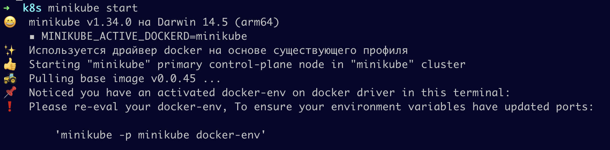
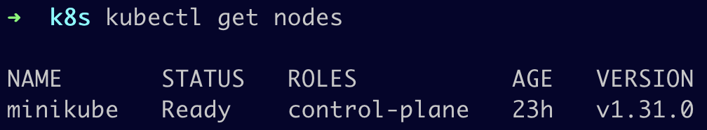
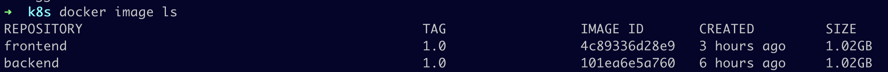
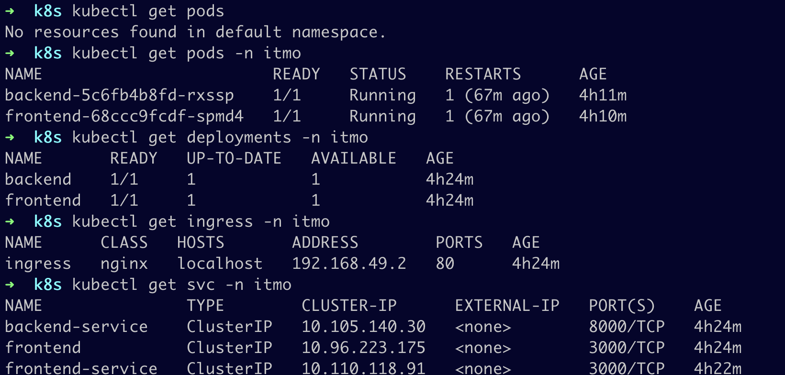
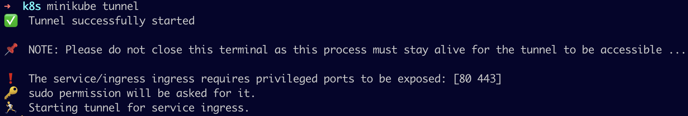
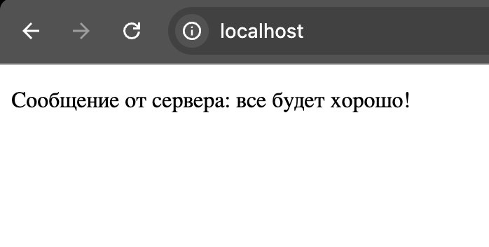

# Лабораторная работа №3

## Обязательное задание

### Введение

В данной лабораторной работе необходимо было локально поднять kubernetes кластер с помощью minikube. При этом в кластере должен быть развернут сервис, используя 2-3 ресурса kubernetes. Использование YAML-файлов, запускаемых одной командой, рекомендуется.

### Скачивание minikube и поднятие кластера

Сначала были скачаны и установлены утилиты minikube и kubectl, необходимые для развертывания приложений, проверки и управления ресурсами кластера.

Далее был запущен minikube с помощью команды `minikube start`, что видно на рисунке:



Затем для проверки работы кластера, а конкретно работы кластера на конкретной ноде была использована команда `kubectl get nodes`. Результат выполнени видно на рисунке ниже.



### Создание контейнеров и написание YAML-конфигов

В качестве системы контейнеризации используется Docker. С его помощью были собраны образы backend и frontend из предыдущей лабораторной работы, они представлены на рисунке ниже.



Для начала был создан namespace в YAML-файле для удобства управления будущими подами. Его конфиг представлен ниже.

```yaml
apiVersion: v1
kind: Namespace
metadata:
  name: itmo
```
Далее был описан под с контроллером Deployment для образа backend. В нем мы прописываем, название, принадлежность к пространству имен, количество реплик, Docker-образ, политику получения Docker-образов, прослушиваемый порт в контенере.

```yaml
apiVersion: apps/v1
kind: Deployment
metadata:
  name: backend
  namespace: itmo
  labels: 
    app: backend
spec:
  replicas: 1
  selector:
    matchLabels:
      app: backend
  template:
    metadata:
      labels:
        app: backend
    spec:
      containers:
        - name: backend
          image: "backend:1.0"
          imagePullPolicy: Never
          ports:
            - containerPort: 8000
```

Затем описываем Service для пода backend для дальнейшей настройки доступа к подам. В YAML-файле для работы сервиса определено имя, пространство имен, порт самого сервиса и порт контейнера, на который будет транслирован трафик.

```yaml
apiVersion: v1
kind: Service
metadata:
  name: backend-service
  namespace: itmo
spec:
  selector:
    app: backend
  ports:
      - port: 8000
        targetPort: 8000
```

Далее был описан Deployment для образа frontend. В его YAML-файле описаны имя пода, пространство имен, количество реплик, Docker-образ, политика получения Docker-образов и номер порта контейнера:

```yaml
apiVersion: apps/v1
kind: Deployment
metadata:
  name: frontend
  namespace: itmo
  labels:
    app: frontend
spec:
  replicas: 1
  selector:
    matchLabels:
      app: frontend
  template:
    metadata:
      labels:
        app: frontend
    spec:
      containers:
        - name: frontend
          image: "frontend:1.0"
          imagePullPolicy: Never
          ports:
            - containerPort: 3000
```

Так же, как и для backend, для frontend был написан Service. В нем так же прописано название, пространство имен, порт сервиса и порт контейнера.

```yaml
apiVersion: v1
kind: Service
metadata:
  name: frontend-service
  namespace: itmo
  labels:
    app: frontend
spec:
  ports:
      - port: 3000
        targetPort: 3000
  selector:
    app: frontend
```

Было принято решение использовать объект Ingress для проксирования трафика от внешнего источника до сервисов внутри кластера, так как нам необходимо делать запросы из браузера в backend. YAML-файл Ingress описывает имя, пространство имен, в котором будет работать объект, адрес и пути, в соответствии с которыми трафик будет направляться на порт 3000 для frontend, и на порт 8000 при обращении к backend. Для корректной работы Ingress была заранее использована команда `minikube addons enable ingress`.

```yaml
apiVersion: networking.k8s.io/v1
kind: Ingress
metadata:
  name: ingress
  namespace: itmo
spec:
  ingressClassName: nginx
  rules:
  - host: localhost
    http:
      paths:
      - path: /
        pathType: Prefix
        backend:
          service: 
            name: frontend-service
            port: 
              number: 3000
      - path: /api
        pathType: Prefix
        backend:
          service: 
            name: backend-service
            port: 
              number: 8000
```

### Применение конфигов

Для удобства применения данного конфига и в соответствии с заданием все YAML-файлы были слиты в один конфиг `deploy.yaml`. Для его применения была использована команда `kubectl apply -f deploy.yaml`. Таким образом, на картинке ниже можно увидеть все созданные объекты kubernetes.



### Создание тоннеля и проверка корректной работы кластера

Далее для проверки работы нашего кластера была использована команда `minikube tunnel`, которая создает свой сетевой маршрут на хосте. В нашем случае Ingress-контроллер будет направлять трафик, приходящий на кластер, в поды.



В браузере для проверки работы кластера и его взаимодействия заходим на localhost и наблюдаем успешную работу кластера с откликом от backend.



## Задание под звездойчкой


