# Лабораторная работа №5

## Обязательное задание

### Введение

В данной лабораторной работе необходимо сделать мониторинг сервиса, поднятого в Kubernetes и показать хотя бы два рабочих графика, которые будут отражать состояние системы.

### Подготовка Kubernetes

Перед установкой всех необходимых пакетов было создано пространство имен `monitoring` с помощью следующий команды:

```bash
kubectl create namespace monitoring
```

После этого оно было выбрано в качестве текущего пространства имен:

```bash
kubectl config set-context --current --namespace=monitoring
```

### Установка необходимых пакетов

#### Установка PostgreSQL

В качестве приложения, для которого будут собираться метрики, был выбран PostgreSQL. Для установки и развертывания PostgreSQL в Kubernetes использовался менеджер пакетов Helm:

```bash
helm install my-postgresql oci://registry-1.docker.io/bitnamicharts/postgresql
```

После этого необходимо было настроить PostgreSQL на сбор метрик. Так как по умолчанию сбор метрик отключен, то для включения сбора метрик был создан файл `postgresql/values.yaml` для переопределения настроек по умолчанию:

```yaml
metrics:
  enabled: true
```

После этого было выполнено обновление конфигурации с помощью следующей команды:

```bash
helm upgrade -f postgresql/values.yaml my-postgresql oci://registry-1.docker.io/bitnamicharts/postgresql
```

#### Установка Prometeus

Для установки Prometeus был добавлен репозиторий `prometheus-community`. Затем был установлен пакет `prometheus` из добавленного репозитория:

```bash
helm repo add prometheus-community https://prometheus-community.github.io/helm-charts
helm install my-prometheus prometheus-community/prometheus
```

#### Установка Grafana

Для установки Grafana был добавлен репозиторий `grafana`. Затем был установлен пакет `grafana` из добавленного репозитория:

```bash
helm repo add grafana https://grafana.github.io/helm-charts
helm install my-grafana grafana/grafana
```

### Настройка Grafana

Для получения информации, необходимой для подключения к Grafana, использовалась следующая команда:

```bash
helm status my-grafana
```

После ее выполнения на экран были выведены инструкции для получения пароля от аккаунта администратора, а также имени пода. С помощью следующей команды был включен проброс портов в под Grafana:

```bash
kubectl --namespace monitoring port-forward $POD_NAME 3000
```

Перейдя по ссылке `http://localhost:3000`, получили следующую страницу:

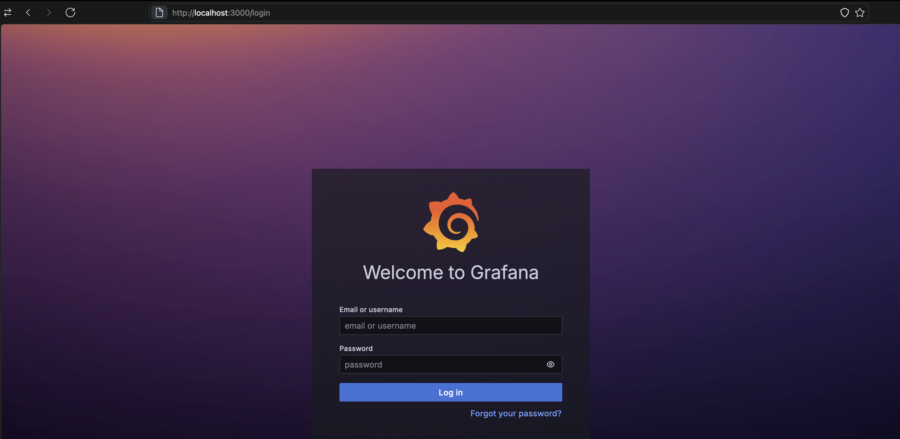

Введя данные аккаунта, полученные ранее, получили следующую страницу:

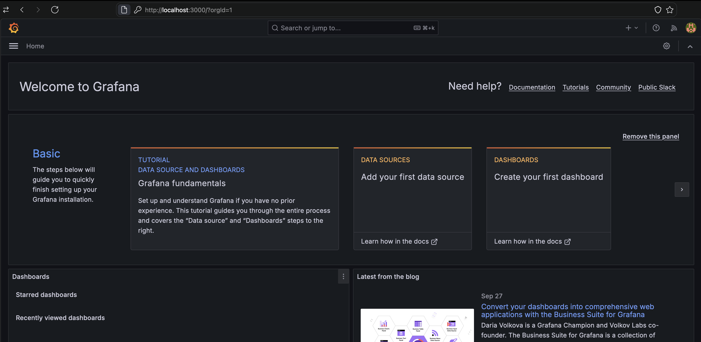

В разделе «Connections -> Data sources» был добавлен источник данных Prometheus. В качестве адреса сервера был указан адрес `http://my-prometheus-server.monitoring.svc.cluster.local`:

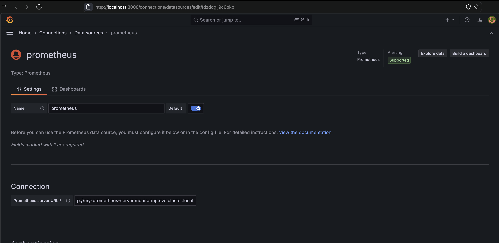

После перехода в раздел «Dashboards» был создан дашборд, который будет использоваться для просмотра метрик.

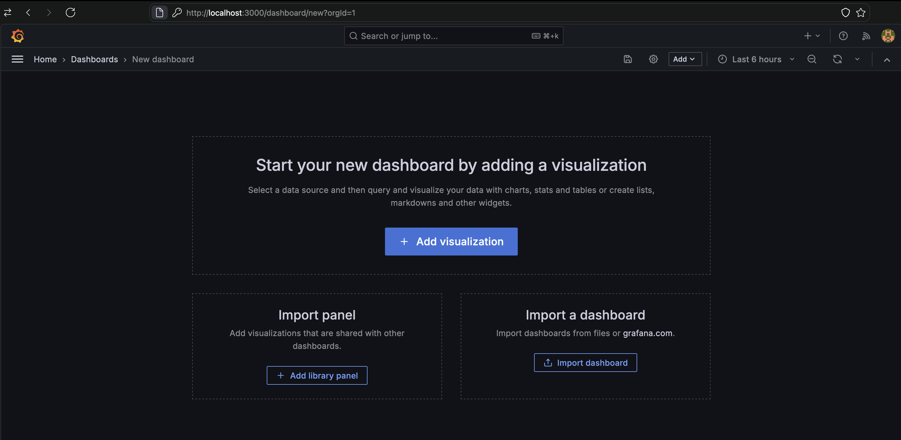

С помощью кнопок «Add -> Visualization» был добавлен первый график. В качестве примера была выбрана метрика `pg_database_size_bytes`, которая показывает размеры баз данных в PostgreSQL. С помощью Query Builder был настроен следующий график:

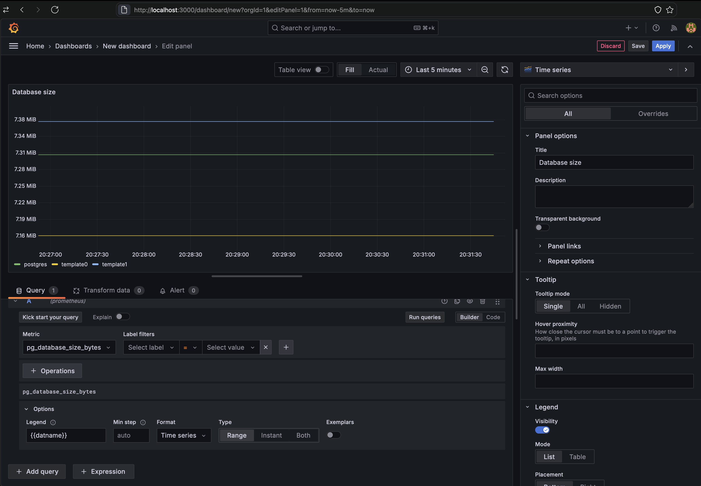

После сохранения изменений, новый график появился на дашборде:

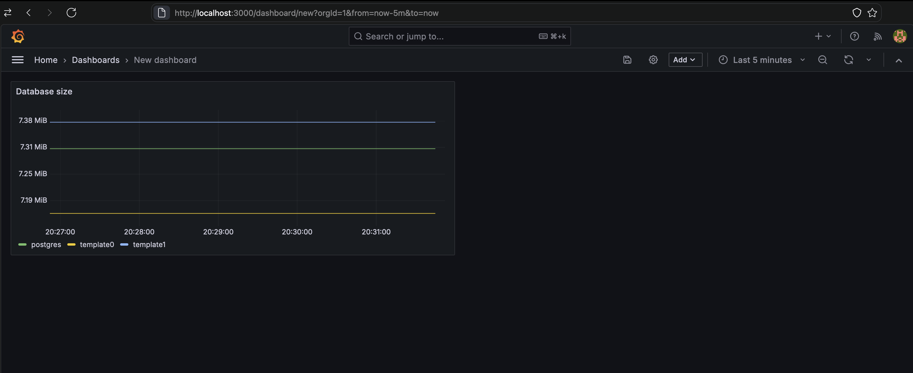

Таким же образом были добавлены еще три графика:

1. График количества соединений.
2. График uptime.
3. График задержки выполнения запросов.

Все они представлены на следующем рисунке:

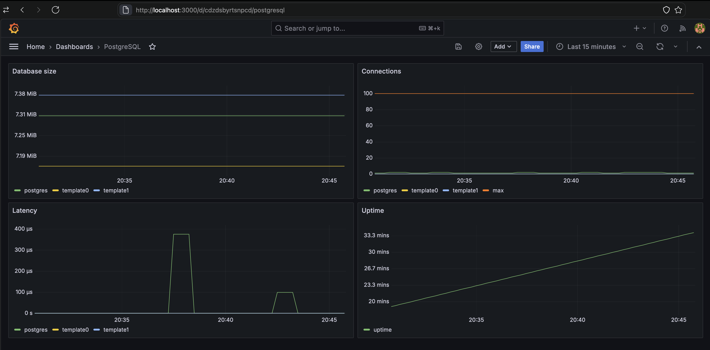

### Заключение

В данной лабораторной работе был сделан мониторинг PostgreSQL на основе Grafana и Prometheus, поднятого в Kubernetes.

## Задание со звездочкой

### Введение

В данной лабораторной работе необходимо настроить алерт в виде IaaC, показать пример его срабатывания. Попробовать сделать так, чтобы он приходил, например, на почту или в Telegram.

В качестве приложения, для которого будут создаваться алерты, использовался PostgreSQL из прошлой части лабораторной работы. Данная лабораторная работа является логическим продолжением предыдущей.

### Создание Telegram-бота

В качестве канала связи, по которому будет приходить алерт, был выбран Telegram. Для этого с помощью Telegram-бота `BotFather` был создан бот `itmo_alert_manager_bot`:

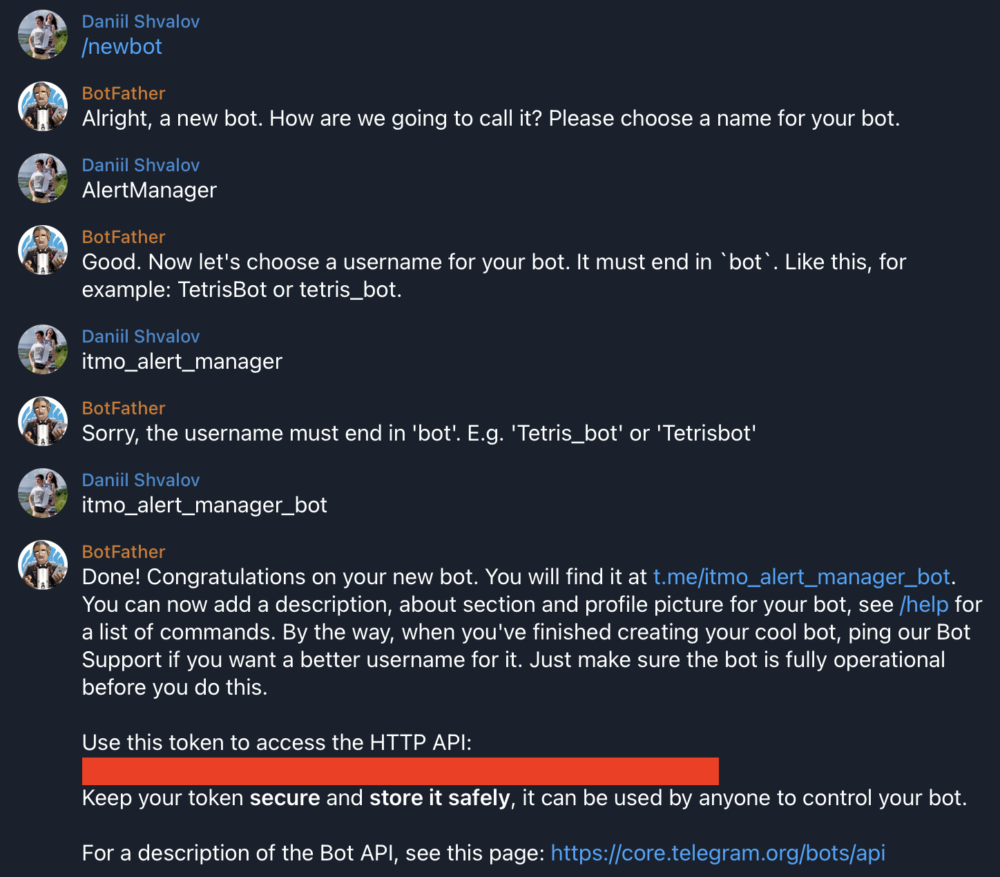

После создания `BotFather` вернул секретный токен бота, с помощью которого будут отправляться уведомления. Также этот токен был использован для получения Chat ID, который понадобится позднее при настройке Alertmanager. Для этого было необходимо перейти по ссылке `https://api.telegram.org/bot<token>/getUpdates` и получить Chat ID:

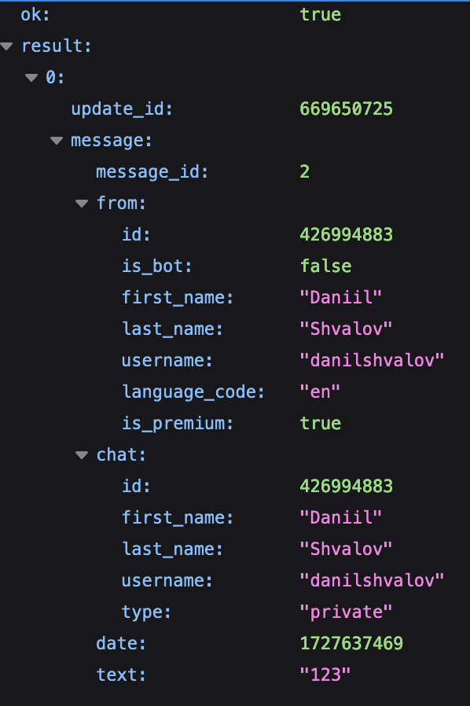

### Настройка Prometheus и Alertmanager

Для настройки Prometheus и Alertmanager использовался следующий конфиг:

```yaml
alertmanager:
  config:
    global:
      resolve_timeout: 5m
      telegram_api_url: "https://api.telegram.org"

    route:
      receiver: telegram-bot

    receivers:
      - name: telegram-bot
        telegram_configs:
          - chat_id: 426994883
            bot_token: <token>
            api_url: "https://api.telegram.org"
            send_resolved: true
            parse_mode: Markdown
            message: |-
              {{ range .Alerts }}
                *Alert:* {{ .Annotations.summary }}
                *Details:*
                {{ range .Labels.SortedPairs }} • *{{ .Name }}:* `{{ .Value }}`
                {{ end }}
              {{ end }}

serverFiles:
  alerting_rules.yml:
    groups:
      - name: postgresql
        rules:
          - alert: Storage overflow
            expr: pg_database_size_bytes > 7 * 1024 * 1024
            for: 1m
            labels:
              severity: critical
            annotations:
              summary: "High storage usage on table {{ $labels.datname }}"
```

В разделе `alertmanager` определяются настройки для Alertmanager. В них прописана конфигурация Telegram-бота (токен, Chat ID и т. п.), а также шаблон сообщений, который будет использоваться в алертах.

В разделе `serverFiles.alerting_rules.yml` задаются правила алертов. В качестве примера был сделан алерт, который загорается, когда в какой-нибудь базе данных PostgreSQL размер таблицы превышает 7 Мбайт.

Данный конфиг был применен с помощью следующей команды:

```bash
helm upgrade -f prometheus/values.yaml my-prometheus prometheus-community/prometheus
```

После этого была выполнена следующая команда для получения информации о `my-prometheus`:

```bash
helm status my-prometheus
```

После выполнения этой команды на экран были выведены инструкции для получения имени подов, а также для проброса портов:

```bash
# Prometheus
export POD_NAME=$(kubectl get pods --namespace monitoring -l "app.kubernetes.io/name=prometheus,app.kubernetes.io/instance=my-prometheus" -o jsonpath="{.items[0].metadata.name}")
kubectl --namespace monitoring port-forward $POD_NAME 9090

# Alertmanager
export POD_NAME=$(kubectl get pods --namespace monitoring -l "app.kubernetes.io/name=alertmanager,app.kubernetes.io/instance=my-prometheus" -o jsonpath="{.items[0].metadata.name}")
kubectl --namespace monitoring port-forward $POD_NAME 9093
```

Эти команды были выполнены в различных окнах терминала. Затем был открыт сайт Prometheus по ссылке `http://localhost:9090`. На нем был выбран раздел «Alerts»:


Как видно на рисунке, добавленные ранее алерты стали активны и «загорелись». Это произошло потому, что на момент включения алертов все таблицы в PostgreSQL превышали заданный порог в 7 Мбайт.

Далее был открыт сайт Alertmanager по ссылке `http://localhost:9093`. В интерфейсе также было видно три алерта, которые соответствовали существующим таблицам в PostgreSQL:

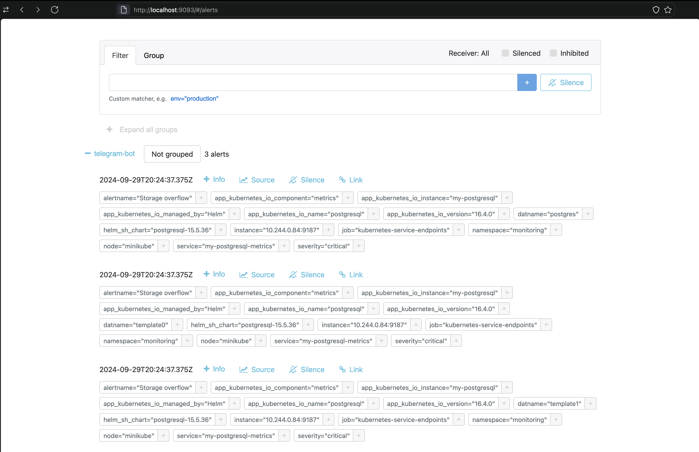

Через некоторое время Telegram-бот прислал три алерта. Содержимое одного из них представлено ниже:

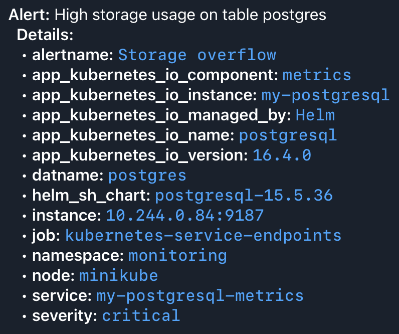

### Заключение

В данной лабораторной работе был настроен алерт в виде IaaC, показан пример его срабатывания. Алерт был сделан так, чтобы он приходил в Telegram.
